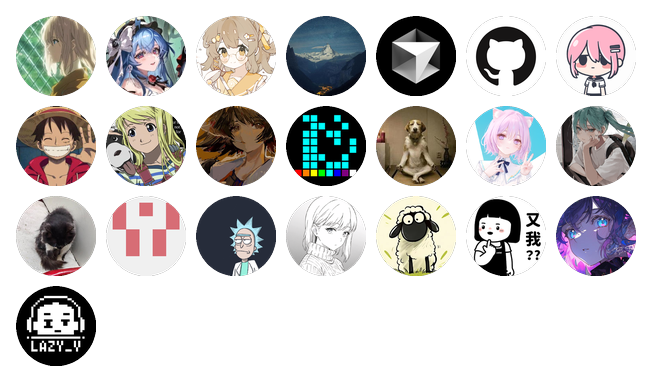

# Thanks, Contributors!

> `thanks-contributors`是一个自动统计组织或多个项目贡献者的开源工具

[](https://github.com/marketplace/actions/thanks-contributors)
[](https://github.com/new?template_name=thanks-contributors&template_owner=Sunrisepeak)
[](LICENSE)
[](https://Sunrisepeak.github.io/thanks-contributors)

| [English](README.md) - [文档](docs/README.md) - [主页](https://Sunrisepeak.github.io/thanks-contributors) |
| --- |

## ✨功能

- 可自定义单仓库或多仓库组合的贡献者统计
- `template`一键配置, 默认统计仓库所在用户的所有公开仓库
- 支持`Github Action`和本地使用
- 支持`Github Pages`自动部署&同步更新
- 支持`贡献者图片墙`和`Markdown贡献者列表`两种格式

## 应用场景 & 案例

- `个人主页` : 显示个人维护的所有仓库和组织 & 案例的贡献者 -> [Sunrisepeak](https://github.com/Sunrisepeak)
- `组织主页` : 显示组织下所有仓库的贡献者 -> [mcpp-community](https://github.com/mcpp-community)
- `单个或多个仓库` : 显示单个仓库的贡献者

## 快速开始

## 方式一: 直接使用项目模板

- 1.通过[创建thanks-contributors](https://github.com/new?template_name=thanks-contributors&template_owner=Sunrisepeak)
- 2.开启新建仓库的`Github Pages`功能 (可选)
  - `Setting -> Pages -> Build and deployment -> Source -> Github Actions`

## 方式二: 使用`GitHub Action`

> 可以通过项目的 [`Marketplace Actions`](https://github.com/marketplace/actions/thanks-contributors) 界面选择已经发布的不同版本

**action**

```yaml
- name: Thanks, Contributors!
  uses: Sunrisepeak/thanks-contributors@0.0.3
```

**完整workflows示例 - `.github/workflows/thanks-contributors.yml`**

```yaml
name: Thanks, Contributors!

on:
  workflow_dispatch:
  schedule:
    - cron: "0 3 * * *"

permissions:
  contents: write

jobs:
  collect:
    runs-on: ubuntu-latest

    steps:
      - uses: actions/checkout@v4

      - name: Collect contributors
        uses: Sunrisepeak/thanks-contributors@0.0.3
```

**指定多个仓库或组织**

```yaml
      #...
      - name: Collect contributors
        uses: Sunrisepeak/thanks-contributors@0.0.3
        with:
            targets: 'Sunrisepeak/* d2learn/* mcpp-community/d2mcpp'
```

> [!CAUTION]
> - 注1: 默认会统计当下用户或组织所有公开仓库的贡献者, 每天自动更新一次, 如果想只统计当前仓库或自定义统计的仓库可以查看 -> [参考文档](docs/README.md)
>
> - 注2: 配置好后, 可以选择手动运行action或等定时触发后观察效果
>
> - 注3: 如果需要切换自动提交为PR的方式, 参考 [Q&A](docs/QA.md)


## 示例

> 当前用户所有公开仓库的贡献者们 - 每天自动更新

### 贡献者图片墙

> 可以在 `README.md` 或 `其他网站` 引用生成的贡献者图片墙

```bash

```


### 可点击的贡献者`Markdown`列表

> 支持自定义文件路径, 以及自定义自动更新区域

<!-- thanks-contributors-flag-start -->
<table>
<tr>
    <td align="center">
        <a href="https://github.com/Sunrisepeak">
            
            <br />
            <sub><b>Sunrisepeak</b></sub>
        </a>
    </td>
    <td align="center">
        <a href="https://github.com/MoYingJi">
            
            <br />
            <sub><b>MoYingJi</b></sub>
        </a>
    </td>
    <td align="center">
        <a href="https://github.com/FrozenLemonTee">
            
            <br />
            <sub><b>FrozenLemonTee</b></sub>
        </a>
    </td>
    <td align="center">
        <a href="https://github.com/wil1jiang">
            
            <br />
            <sub><b>wil1jiang</b></sub>
        </a>
    </td>
    <td align="center">
        <a href="#">
            
            <br />
            <sub><b>speak</b></sub>
        </a>
    </td>
    <td align="center">
        <a href="https://github.com/2412322029">
            
            <br />
            <sub><b>2412322029</b></sub>
        </a>
    </td>
    <td align="center">
        <a href="https://github.com/tiansongyu">
            
            <br />
            <sub><b>tiansongyu</b></sub>
        </a>
    </td>
    <td align="center">
        <a href="https://github.com/sky-littlestar">
            
            <br />
            <sub><b>sky-littlestar</b></sub>
        </a>
    </td>
</tr>
<tr>
    <td align="center">
        <a href="https://github.com/521xueweihan">
            
            <br />
            <sub><b>521xueweihan</b></sub>
        </a>
    </td>
    <td align="center">
        <a href="https://github.com/Ankali-Aylina">
            
            <br />
            <sub><b>Ankali-Aylina</b></sub>
        </a>
    </td>
    <td align="center">
        <a href="https://github.com/ExquisiteCore">
            
            <br />
            <sub><b>ExquisiteCore</b></sub>
        </a>
    </td>
    <td align="center">
        <a href="https://github.com/Hebown">
            
            <br />
            <sub><b>Hebown</b></sub>
        </a>
    </td>
    <td align="center">
        <a href="https://github.com/13eholder">
            
            <br />
            <sub><b>13eholder</b></sub>
        </a>
    </td>
    <td align="center">
        <a href="https://github.com/lost-42">
            
            <br />
            <sub><b>lost-42</b></sub>
        </a>
    </td>
    <td align="center">
        <a href="https://github.com/topshihun">
            
            <br />
            <sub><b>topshihun</b></sub>
        </a>
    </td>
    <td align="center">
        <a href="https://github.com/jwaiting">
            
            <br />
            <sub><b>jwaiting</b></sub>
        </a>
    </td>
</tr>
<tr>
    <td align="center">
        <a href="https://github.com/Mq-b">
            
            <br />
            <sub><b>Mq-b</b></sub>
        </a>
    </td>
    <td align="center">
        <a href="https://github.com/d2learn-org">
            
            <br />
            <sub><b>d2learn-org</b></sub>
        </a>
    </td>
    <td align="center">
        <a href="https://github.com/zzxzzk115">
            
            <br />
            <sub><b>zzxzzk115</b></sub>
        </a>
    </td>
    <td></td>
    <td></td>
    <td></td>
    <td></td>
    <td></td>
</tr>
</table>
<!-- thanks-contributors-flag-end -->
